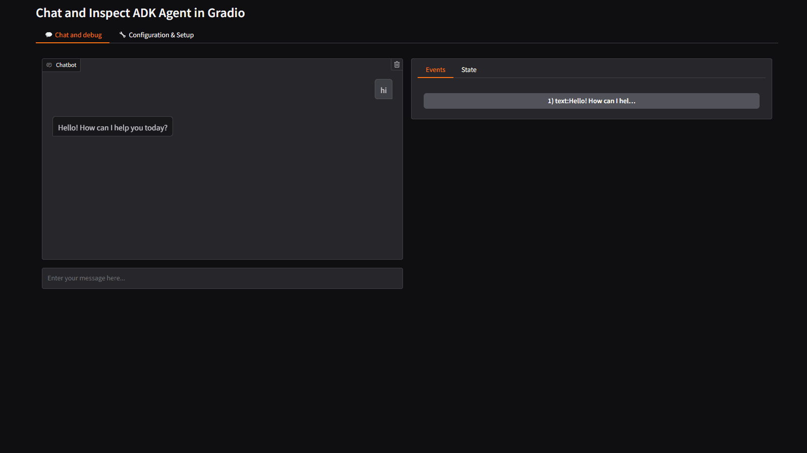

# Agent Development Kit (ADK) + Gradio


Debugging agent-based applications can be tricky!  

Agent Inspector is a Gradio component designed to make this process easier and more transparent.  
Inspired by tools like the [ADK web](https://github.com/google/adk-web) debug panel, Agent Inspector brings similar functionality to the Gradio ecosystem.  
Whether you're building, testing, or fine-tuning your agent, Agent Inspector helps you understand what's happening under the hood.


## Demo App with ADK



App demo available here : [](https://huggingface.co/spaces/Agents-MCP-Hackathon/adk-gradio?logs=container)

2 options to run this app : 
- with an external ADK API server

```bash
# start the adk server
adk api_server adk-gradio-example/adk_gradio_example/adk_agents
# start the app
cd adk-gradio-example
python app.py
```

- with the ADK API server started with the app

```bash
# start the app with the adk server
cd adk-gradio-example
python app.py --no-external-adk-api-server
```

## Custom Gradio Component : Agent Inspector 🕵️‍♂️ 

Component demo available here: [](https://huggingface.co/spaces/Agents-MCP-Hackathon/gradio_agent_inspector)

### To debug the new Gradio component in dev mode
```bash
cd gradio-custom-components\agent-inspector
gradio cc dev
```

### Build the custom component
```bash
cd gradio-custom-components\agent-inspector
gradio cc build
```
